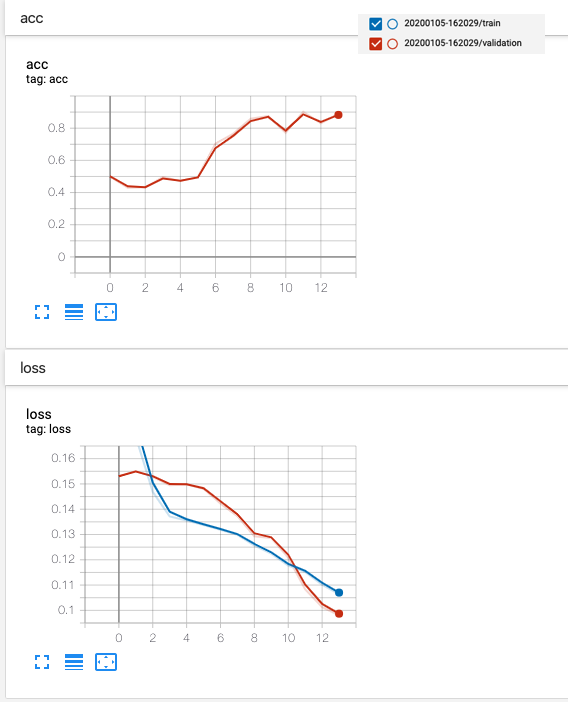
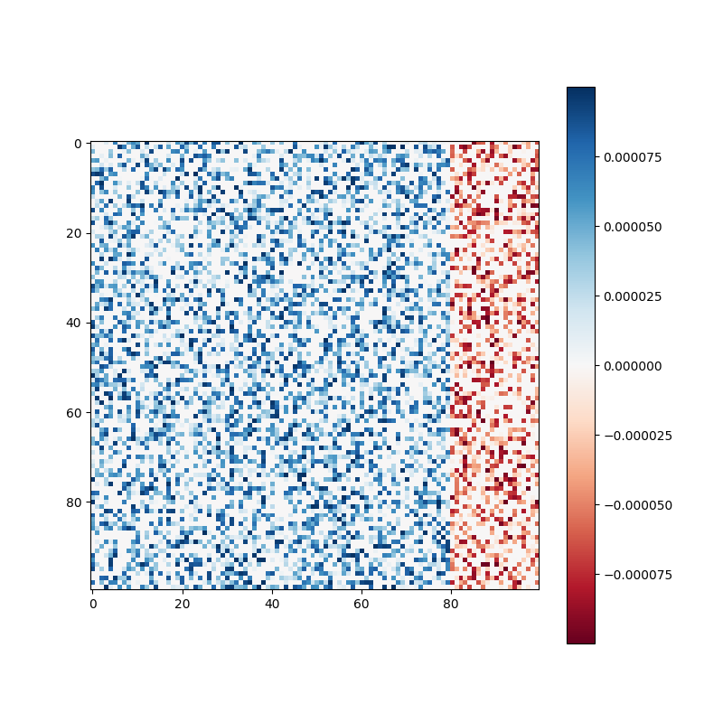
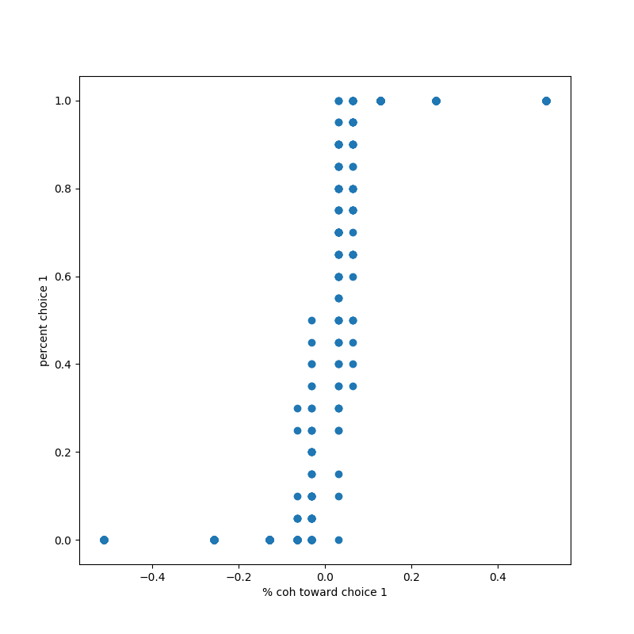

# Perceptual decision making - Random Dots
**Inhibitory Recurrent Neural Networks for Cognitive**

`So far only for RT version`

Xiaohe Xue

## Itroduction

This project trys to implementate the Perceptual Decision Making Task in the paper [**Training excitatory-inhibitory recurrent neural networks for cognitive tasks: A simple and flexible framework**](https://journals.plos.org/ploscompbiol/article?id=10.1371/journal.pcbi.1004792)

## Requirement

Python 3

Tensorflow 2.0

## Usage

`python main.py` 

> -a, --action,  test/train
>
> -tv, --task_version, rt/fd
>
> --init_state_trainable, set if init sate trainable
>
> -e_num, --epoch_num, num of epochs for training
>
> -e_size, --epoch_size, default=1000, num of trails in one epoch for training
>
> --model_date, None/string(%Y%m%d-%H%M%S, the path of checkpoint coreesponding to the date when it is saved)

## Reaction-Time

> In the RT task, the choice targets were displayed for a variable interval before 
the onset of the motion stimulus. The duration of this prestimulus interval was randomly selected 
from an exponential distribution (mean 700 msec). This randomization served to discourage 
anticipation of the onset of the motion stimulus. We found that randomization of the prestimulus 
interval in this fashion was essential for training on the RT task. When the onset of the stimulus
 was predictable, RT was faster than in these experiments and varied less across the range of 
 coherences. Once the motion stimulus began, the monkey was free to indicate its choice at any time. 
 When the computer detected a break in fixation, the random dots were extinguished. If the monkey
 made a saccade to either choice target, the trial was scored as correct or incorrect. 
 Breaks in fixation that were not associated with an immediate saccade to a choice target 
 were rare and are not included in our data set.

-   Response of neurons in the lateral intraparietal area during a combined visual
  discrimination reaction time task.J. D. Roitman & M. N. Shadlen, JNS 2002. http://www.jneurosci.org/content/22/21/9475.abstract

### Runing results

- Loss and accuracy during training

- W_rec matrix

- The plot showing the percentage of trials on which the network chose choice 1 as a function of the signed coherence, which fits the Psychometric function in the paper.

## TODO

- [ ] Extract reaction time

## Reference

- [pycog](https://github.com/frsong/pycog): Train excitatory-inhibitory recurrent neural networks for cognitive tasks.
- [PychRNN](https://github.com/dbehrlich/PsychRNN): A package is intended to help cognitive scientist easily translate task designs from human or primate behavioral experiments into a form capable of being used as training data for a recurrent neural network.

